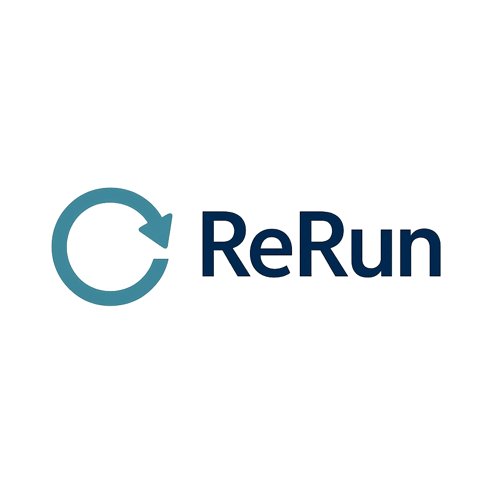

ReRun Documentation
====================

**ReRun** is a desktop application that helps researchers design and execute reproducible scientific analyses using **Stata**, **Python**, or **R**.  
It provides a structured workflow system that promotes best practices in **replicability**, **transparency**, and **computational reproducibility**.

ReRun allows analyses to be organized into **Steps** and **Jobs**:

- **Steps** are executed sequentially, representing major stages of the workflow.
- **Jobs** within each step run in parallel, enabling efficient execution of independent tasks.

The application supports both **local** execution (using installed software) and **containerized** execution via **Docker** or **Singularity**, ensuring that analyses can be reproduced across different environments.

ReRun is cross-platform and runs on **Windows** and **Linux**.  

.. note:: 
   macOS support is limited due to a `FilePicker` issue in Flet v0.28.3 — see the `Flet issue tracker <https://github.com/flet-dev/flet/issues/5334>`_ for details.

Contents
--------

.. toctree::
   :maxdepth: 3

   introduction
   installation
   usage/index
   troubleshooting

