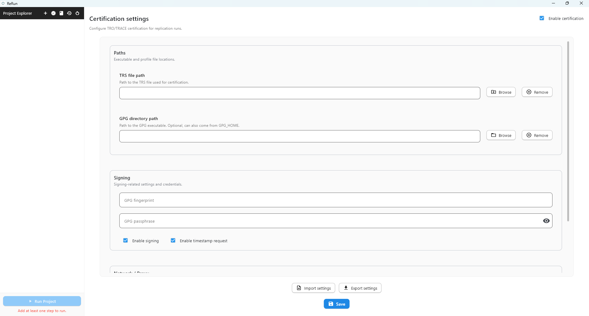

Certification Process (TRACE / TRO)
===================================

ReRun includes an optional certification workflow that produces machine-readable provenance artifacts
for each replication run.

This integration is built around:

- **TRACE** (Transparency Certified): https://transparency-certified.github.io/
- **tro-utils** (CLI and tooling used to build TRO declarations and arrangements):
  https://github.com/transparency-certified/tro-utils

What Certification Does
-----------------------

When enabled, ReRun records the replication execution lifecycle and generates certification artifacts
inside a ``certification/`` folder under the replication directory.

At a high level, ReRun:

1. Validates certification settings and required inputs.
2. Captures pre-run and post-run arrangements.
3. Records run timing metadata.
4. Creates one or two TRO performances (depending on restricted data usage).
5. Optionally signs and timestamps the TRO declaration.

Where to Configure in the UI
-------------------------------

In the active workspace, open the **Certification settings** view in the right panel.

Main settings include:

- **Enable certification**
- **TRS file path** (profile file used for certification)
- **GPG directory path**
- **GPG fingerprint** and **GPG passphrase** (optional)
- **Enable signing**
- **Enable timestamp request**
- **HTTP/HTTPS proxy** (optional)

Use **Save** to persist certification settings before running the project.

Arrangement and Performance Model
---------------------------------

The current certification flow models both replication files and restricted-data access boundaries.

**Pre-run arrangements**

- Always includes the replication folder state before execution.
- If a restricted data path is configured, that restricted path is also added as an arrangement.

**Post-run arrangements**

- Always includes the replication folder state after execution.
- If a restricted data path is configured, that restricted path is again added as an arrangement
  to represent its post-run observed state.

**Performance 1 (always)**

- Links pre-run arrangements to post-run arrangements for the replication execution window.

**Additional transition when restricted data path exists**

After the replication finishes, ReRun adds another arrangement containing **only the replication folder**.
This models the state after restricted-data access is considered closed.

**Performance 2 (restricted-data case only)**

- Links post-run arrangements (including restricted-data arrangement) to the replication-only arrangement.
- Represents the transition to a state with no further restricted-data access.

Lifecycle in ReRun
------------------

ReRun executes certification as part of the replication service lifecycle:

- **Initialization phase**

  - prepares the certification directory and output file paths;
  - validates configuration;
  - writes initial run metadata stub.

- **Pre-run capture**

  - captures the pre-run arrangements.

- **Run tracking**

  - records replication start and end timestamps.

- **Post-run capture**

  - captures post-run arrangements.

- **Finalization**

  - records TRO performance(s);
  - adds replication-only transition artifacts when restricted data is configured;
  - writes/updates declaration and optional signing/timestamping outputs.

Certification is handled as a best-effort process: failures are reported in logs and metadata,
without crashing the overall replication execution.

Expected Output Artifacts
-------------------------

Inside ``RepXXX/certification/``, you should expect files such as:

- TRO declaration (default name: ``tro.jsonld``)
- Run metadata (timing, arrangement ids, and certification status)
- Any additional evidence/signature outputs produced by the configured workflow

Exact output depends on whether signing and timestamping are enabled and on environment/tool availability.

Operational Notes
-----------------

- If certification dependencies are missing or invalid, ReRun logs the reason and continues the replication run.
- Proxy settings can be configured directly in the certification panel when network access is constrained.

Related Documentation
---------------------

- :doc:`configuration_files`
- :doc:`interface_reference`