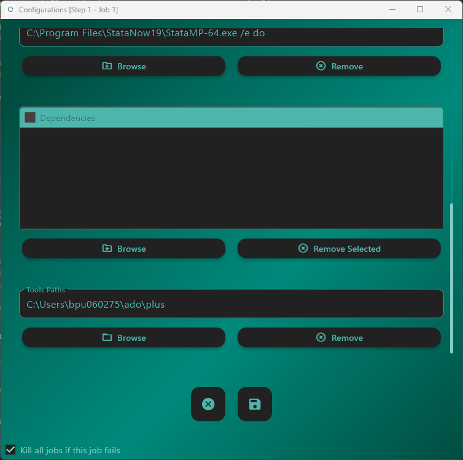

Configuration Files
===================

ReRun automatically generates configuration files for each job based on the selected runtime environment — **Stata**, **R**, or **Python**.

These configuration files define environment-specific variables and paths used during execution.  
They ensure that scripts can locate all required resources (data, outputs, and dependencies) without relying on hardcoded paths.

Defined Path Variables
----------------------

Each job configuration file defines a consistent set of path variables:

- **Replication Path** – Root directory of the current replication (e.g., ``Rep001``).  
- **Job Path** – Directory corresponding to the current job.  
- **Main Script Path** – Directory where the main script is located.  
- **Data Path** – Directory containing the input data specified during replication setup.

These paths are determined dynamically and stored in the configuration file by ReRun, ensuring full portability across systems and environments.

Example (Stata)
---------------

The following excerpt, taken from the configuration file automatically generated in :doc:`A Small Example in Stata <stata_small_example>`,  
shows how ReRun defines environment paths within Stata’s ``profile.do`` script:

.. code-block:: stata
   :caption: profile.do (excerpt)

   *********************************************************
   *               Define globals                          *
   *********************************************************  
   * Replication Path
   find_replication_path
   global rep_path "`r(rep_path)'"

   * Job Path 
   global job_path "${rep_path}/Step01/Job01"

   * Main Script Path 
   global path_main = "${job_path}"

   *** Paths for Data ***
   * Set the path for non-perturbed data source
   read_data_path using "${rep_path}/config.json"
   global path_source "`r(data_path)'"

The **replication path** is determined dynamically using the ``find_replication_path`` function,  
which searches parent directories until it finds the ``config.json`` file that marks the replication root.

.. warning::
   The file ``config.json`` must be unique within the replication tree.  
   If multiple copies exist, ReRun may assign incorrect paths to the job environment.

Examples (Python and R)
-----------------------

For jobs written in **Python** or **R**, ReRun automatically creates equivalent configuration files named ``config.py`` and ``config.R``.  
These files serve the same purpose as the Stata configuration — defining the replication, job, main script, and data paths dynamically.

.. code-block:: python
   :caption: config.py (excerpt)

    # Replication Path
    REP_PATH = find_replication_path()
    # Job path 
    JOB_PATH = REP_PATH  / "Step01" / "Job01"
    # Main script path 
    PATH_MAIN = JOB_PATH 

    ### Paths for data ###
    # Set the path for non perturbed data source
    with open(REP_PATH / "config.json") as file:
        config = json.load(file)
    PATH_SOURCE = Path(config.get("data_path", "."))

.. code-block:: R
   :caption: config.R (excerpt)

    # Replication Path
    rep_path <- find_replication_path()
    # Job path 
    job_path <- file.path(rep_path, "Step01", "Job01")
    # Main script path 
    path_main <- file.path(job_path) 
    # Data Path 
    data_path <- get_json_value(file.path(rep_path, "config.json"), "data_path")

Variable Logic
--------------

- The **Job Path** is always defined relative to the replication directory and is created automatically by ReRun.  
- The **Main Script Path** points to the location of the primary execution script.  
  - If the main script resides directly within the job folder, this path equals the job path.  
  - If your job uses a nested folder structure (e.g., ``Job01/scripts/main.do``), ReRun preserves the subfolder structure when copying files.  
- The **Data Path** points to the dataset directory selected during replication setup and is read from the ``config.json`` file using the appropriate helper function (e.g., ``read_data_path`` or ``get_json_value``).  

These conventions ensure that every ReRun job is self-contained, portable, and fully reproducible —  
with no need to modify file paths manually between systems.  
Your code will execute consistently on any compatible environment, provided that all required dependencies are available.

In Stata, Python, and R, these configuration files must be **loaded at runtime**.  
Since the configuration file is always located in the same directory as the main script,  
users can initialize the environment by explicitly running or importing the configuration file:

- ``include profile.do`` in **Stata**  
- ``source("config.R")`` in **R**  
- ``from config import *`` in **Python**

.. warning::
   When executing dependent scripts In Python (i.e., scripts called from the main file),  
   you must ensure that these global variables persist across files.  
   The ``run_script`` function from the `BPLIM Utils <https://github.com/BPLIM/bplim-utils>`_ package  
   provides a convenient way to achieve this functionality — similar to how ``do`` works in Stata or ``source`` in R.

Local vs Containerized Behavior
-------------------------------

Configuration files differ depending on whether the job runs **locally** or within a **container**.

When running locally, the configuration file adjusts the paths from which the runtime loads modules, packages, or commands, effectively restricting execution to a single controlled environment.  
These tool dependencies must reside in the **tools** folder of the replication, which is defined in the **Tools Path** field of the Job Configuration Window.

In **Stata**, this typically corresponds to the ``PLUS`` directory:

When a tools path is specified, ReRun creates a folder named ``tools`` within each job, duplicating the structure and contents of the selected source directory.  
The configuration files then adjust accordingly based on the execution mode (local or containerized).

Local Execution
---------------

In **local mode**, ReRun modifies configuration files so that the runtime environment only searches for tools and libraries within the replication directory.  
For **Stata**, the generated ``profile.do`` includes the following instructions:

.. code-block:: stata
   :caption: profile.do (excerpt)

    * Remove default ado paths
    local places "SITE PERSONAL OLDPLACE"

    foreach p of local places {
        capture adopath - `p'
    }

    * Point PLUS to the path in the replication
    sysdir set PLUS "${job_path}/tools"

For **Python** and **R**, the configuration files include similar path redefinitions:

.. code-block:: python
   :caption: config.py (excerpt)

    # Add the tools folder to sys.path
    sys.path.append(str(JOB_PATH / "tools"))

.. code-block:: R
   :caption: config.R (excerpt)

    # User-defined libraries
    .libPaths(paths$tools)

.. warning::
   In Python, if a ``tools`` folder exists, this instruction is always applied.  
   It is up to the user to include the ``-S`` flag in the **Command** field of the Job Configuration Window  
   to ensure that Python loads only the standard library modules, avoiding system-wide packages.

These modifications ensure that the runtime environment uses only the libraries, packages, and commands that have been explicitly copied into the replication area, providing strict reproducibility and isolation.

Containerized Execution
-----------------------

When executing within a container (e.g., Docker or Singularity), configuration files behave differently.  
Since containers encapsulate a fixed environment, ReRun does not replace system paths — instead, it appends the ``tools`` folder to the list of search paths.

For **Stata**, the configuration looks like this:

.. code-block:: stata
   :caption: profile.do (excerpt)

    *** Path for project-specific ado files ***
    adopath ++ "${job_path}/tools"

For **R**, the configuration expands the existing library search path rather than replacing it:

.. code-block:: R
   :caption: config.R (excerpt)

    # User-defined libraries
    .libPaths(c(paths$tools, .libPaths()))

In containerized runs, the ``tools`` folder is still copied into the replication, but the configuration file only appends it to the search path.  
This behavior assumes that the containerized runtime already provides a consistent, shareable environment, allowing all users to reproduce analyses reliably without altering core system paths.

