A Containerized Example (Stata, Parallel Jobs)
==============================================

This example demonstrates how to run **two Stata jobs in parallel** inside the **same Step**, using a **Docker container** as the execution backend in ReRun.  
Both jobs read from the same dataset, perform independent analyses, and write their outputs to separate job folders.

This example illustrates:

- How to configure Stata jobs to run inside a Docker container.
- How parallelization works inside a single Step.
- How ReRun isolates job environments and organizes outputs.

.. warning::
   To run this example, you must have **Docker** installed and running.  
   In addition, Docker must be configured to allow **file sharing** with at least your home directory  
   (e.g. ``C:\Users\user\`` on Windows), because ReRun mounts the home folder into the container  
   (for example, as ``/mnt/c/Users/user``).  
   This example assumes that the replication folder, data, and scripts all reside somewhere under your home directory.

Example Input Structure
-----------------------

Your project directory should contain:

.. code-block:: text

   C:\Users\bpu060275\Desktop\work_container
   ├── data\
   │   └── auto.dta
   └── scripts\
       ├── job1.do
       └── job2.do

- ``data`` contains the dataset.  
- ``scripts`` contains the two Stata jobs.  
- The container will be a **Docker** image with Stata installed named **stata:18**.

Stata Job Scripts
-----------------

Below are the full contents of the two Stata scripts used in this example.

Job 1 — ``job1.do``
~~~~~~~~~~~~~~~~~~~~

.. code-block:: stata
   :caption: job1.do

    ***************************************************
    * Parallel Job 1 (container/local)
    * - Reads data from ${path_source}\auto.dta
    * - EDA, correlation, regression, margins
    * - Writes: job1_example.log
    * - Approx. runtime: 30 seconds
    ***************************************************
    version 18.0
    clear all
    set more off

    include profile.do
    cd "${path_main}"

    log using "job1_example.log", replace

    use "${path_source}/auto.dta", clear

    describe
    summarize price mpg weight, detail
    corr price mpg weight

    regress price mpg weight i.foreign, vce(robust)
    margins foreign
    marginsplot, name(m1, replace) nodraw

    preserve
    collapse (mean) price mpg weight, by(foreign)
    export delimited using "${path_main}/job1_means_by_foreign.csv", replace
    restore

    forvalues t = 1/6 {
        di as txt "Job1 progress: " `t' " / 6"
        sleep 5000
    }

    log close
    exit 0

Job 2 — ``job2.do``
~~~~~~~~~~~~~~~~~~~~

.. code-block:: stata
   :caption: job2.do

    ***************************************************
    * Parallel Job 2 (container/local)
    * - Reads data from ${path_source}\auto.dta
    * - Weight binning, ANOVA, grouped means
    * - Writes: job2_example.log
    * - Approx. runtime: 30 seconds
    ***************************************************
    version 18.0
    clear all
    set more off

    include profile.do
    cd "${path_main}"

    log using "job2_example.log", replace

    use "${path_source}/auto.dta", clear

    generate ln_price = ln(price)
    xtile weight_bin = weight, nq(5)
    label var weight_bin "Weight quintile (1 = lightest, 5 = heaviest)"

    bys weight_bin: summarize price mpg weight

    anova price i.weight_bin

    preserve
    collapse (mean) price mpg weight ln_price, by(weight_bin)
    export delimited using "${path_main}/job2_means_by_weightbin.csv", replace
    restore

    forvalues t = 1/6 {
        di as txt "Job2 progress: " `t' " / 6"
        sleep 5000
    }

    log close
    exit 0

Launching the Replication
-------------------------

Starting a New Replication
~~~~~~~~~~~~~~~~~~~~~~~~~~

Click **Start New Replication** in the main application window:

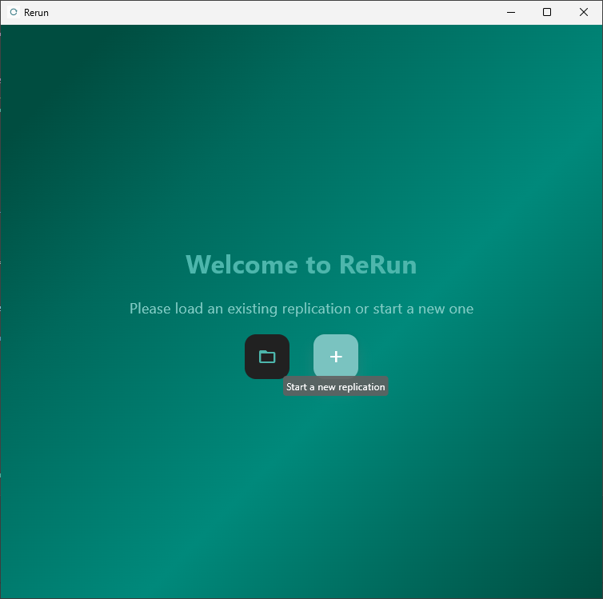

Provide Input Paths
~~~~~~~~~~~~~~~~~~~

Specify the **Output Path** and **Data Path**, then click **Start**:

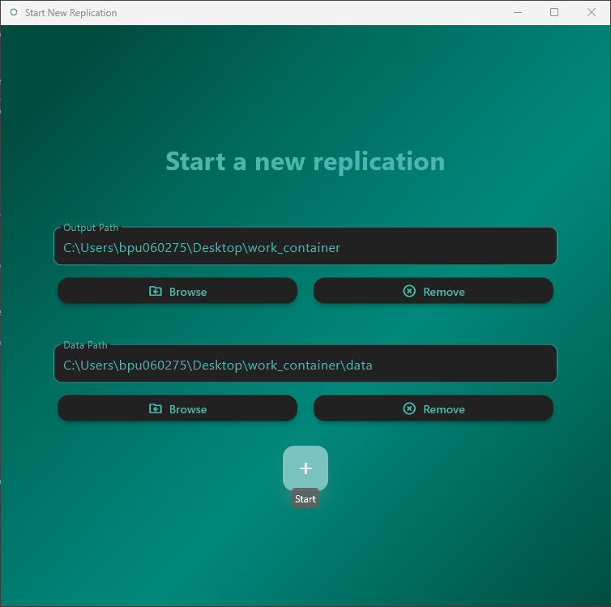

Configuring the Step
--------------------

After initialization, the Steps Window opens.  
Click **Configure** on Step 1:

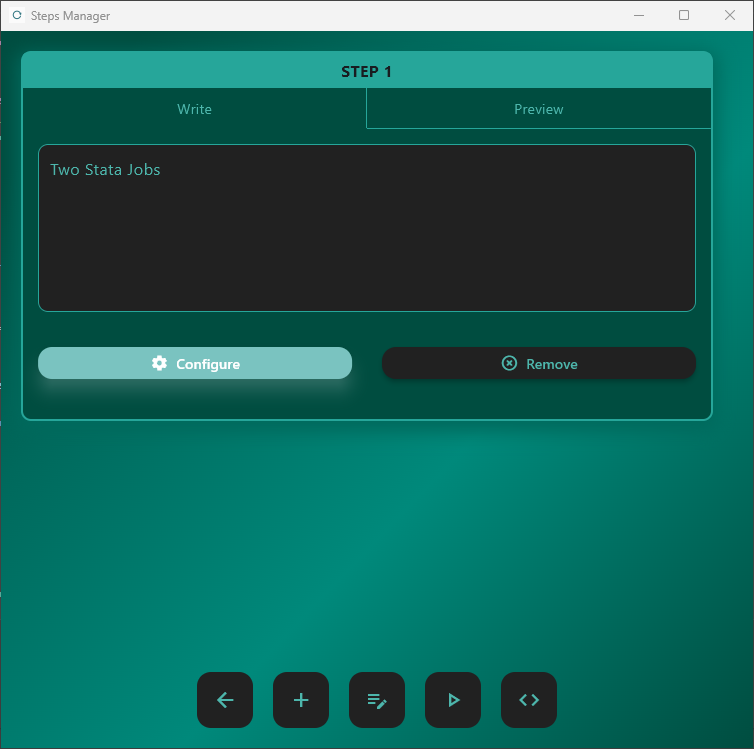

Adding the Two Jobs
-------------------

Click **Add Job** in the Jobs Window:

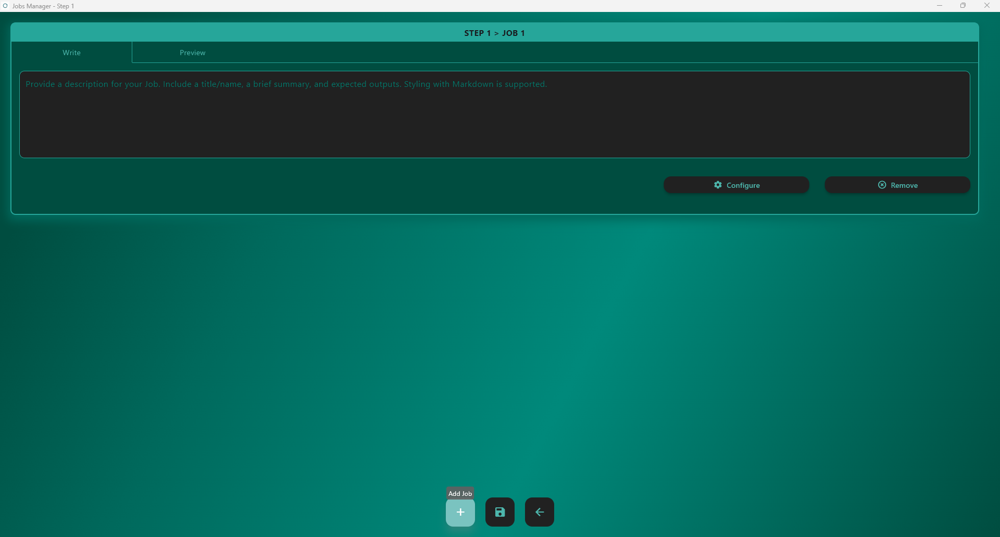

You may add descriptive text to document each job:

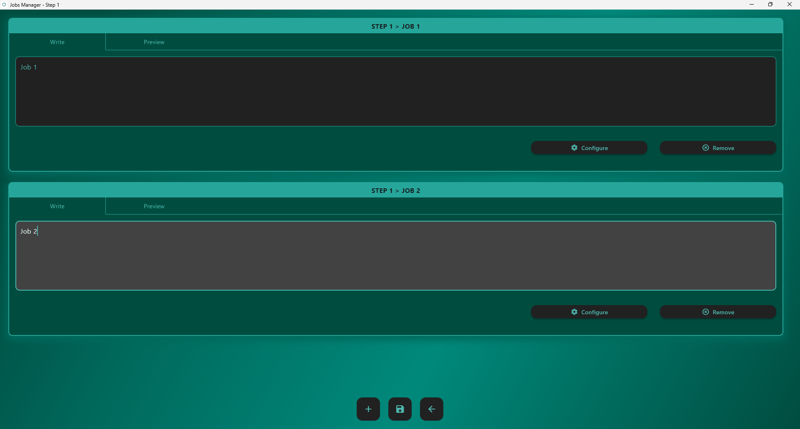

Configuring Job 1
~~~~~~~~~~~~~~~~~

Select the job and click **Configure**:

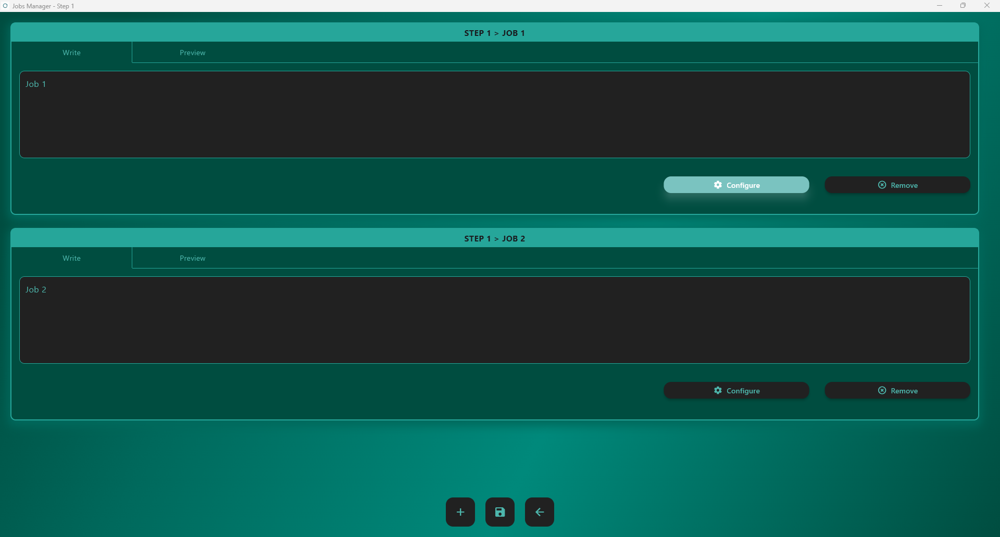

Set the container execution parameters:
 
- **Main Path**: your ``scripts`` folder  
- **Main Script**: ``job1.do``  
- **Container Image**: your Docker image with Stata installed ``stata:18``  
- **Command**: the Stata executable inside the container (e.g., ``stata-mp -b do``)

Then save:

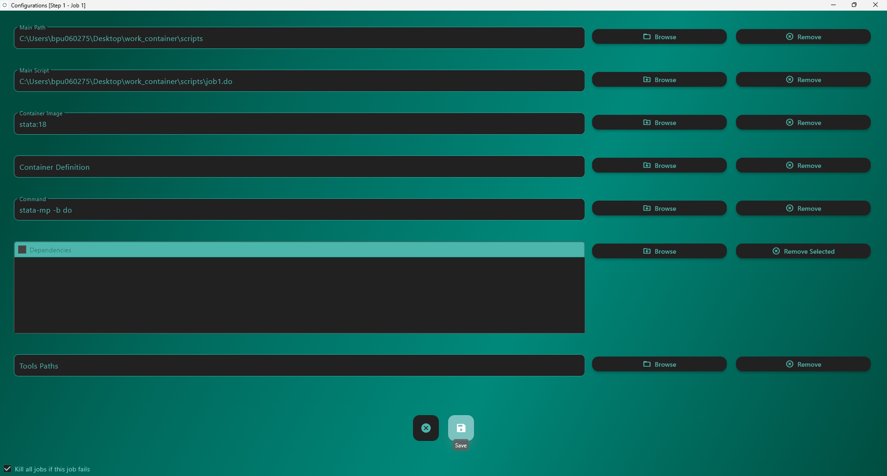

Do the same for **Job 2**, changing only the script to ``job2.do``.

Finally, save all jobs and return to the Steps Window:

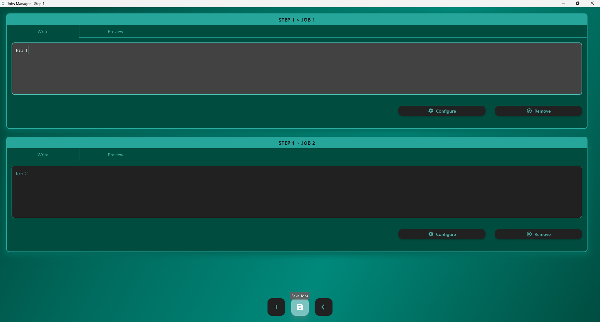

Running the Parallel Jobs
-------------------------

Back in the Steps Window, click **Run Steps**:

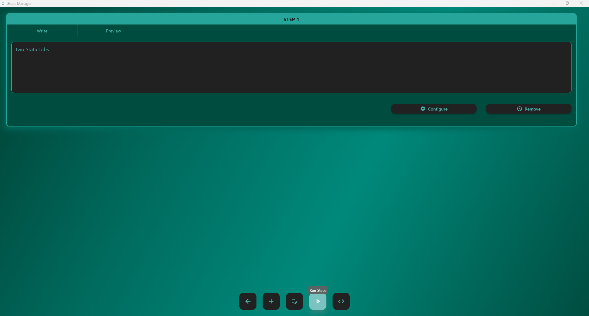

ReRun opens the **Execution Window**.  
Each job starts its **own Docker container instance**, and because both jobs are launched for the same step, they run **in parallel** as independent processes.

Jobs starting:

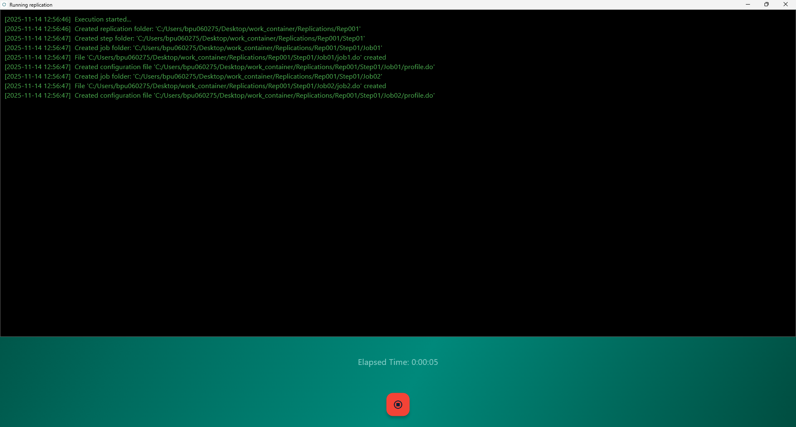

Both jobs executing:

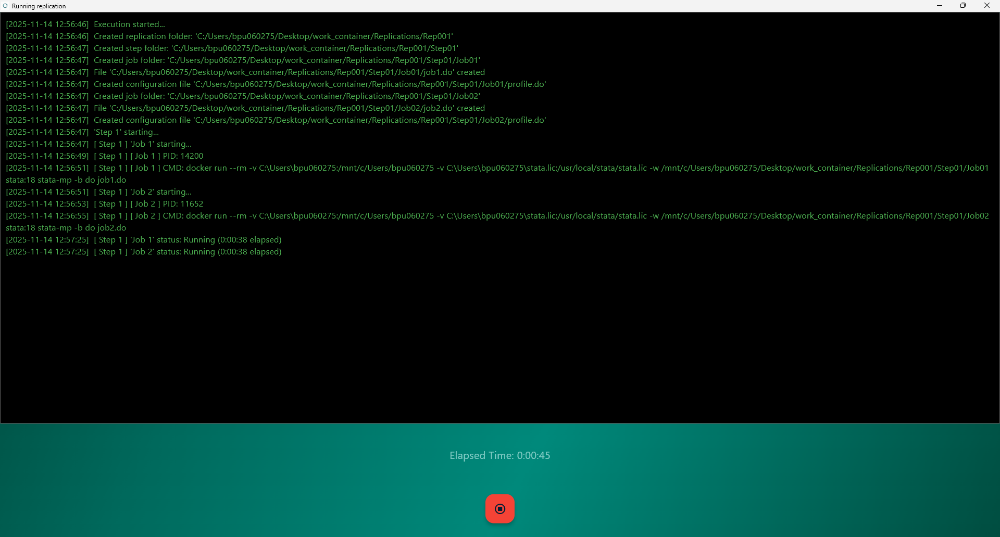

Job progress and completion:

.. image:: ../_static/container_example/10_running_window_03.png
   :alt: Execution window with progress
   :width: 640

In this example, the entire step finished in **42 seconds** because both jobs were executed
at the same time.  
If the same two jobs were run one after the other, the total runtime would be **over one minute**.

Running jobs in parallel makes the overall process faster, but it comes with trade-offs:
it increases **CPU usage** (because multiple jobs run at once) and may increase **memory (RAM)
usage**, depending on the amount of data each job loads and the operations it performs.  
Users running several jobs in parallel should make sure their system has enough CPU cores
and available memory.

Output Structure
----------------

After the run completes, the replication folder looks like:

.. code-block:: text

   Replications/Rep001
   ├── config.json
   ├── datafiles.txt
   ├── manifest.json
   ├── log.txt
   ├── readme.md
   ├── replication_tree.txt
   ├── Step01/
   │   ├── readme.md
   │   ├── Job01/
   │   │   ├── job1.do
   │   │   ├── job1_example.log
   │   │   ├── job1_means_by_foreign.csv
   │   │   ├── profile.do
   │   │   └── job1.log
   │   └── Job02/
   │       ├── job2.do
   │       ├── job2_example.log
   │       ├── job2_means_by_weightbin.csv
   │       ├── profile.do
   │       └── job2.log

Each job has its own independent logs, CSVs, and configuration.

Differences Between Local and Containerized Execution
-----------------------------------------------------

When running locally or inside a Docker/Singularity container, ReRun produces the same replication structure,  
but certain configuration details differ. This section describes the main differences, focusing on:

- Path handling in ``config.json``  
- How ReRun maps host directories into Docker  
- Differences in the execution command  
- Stata license handling in a container

Path Differences
~~~~~~~~~~~~~~~~

In **local execution**, paths in ``config.json`` correspond directly to the file system of the host.  
For example:

.. code-block:: json
   :caption: Local ``config.json`` (excerpt)

   {
       "data_path": "C:/Users/bpu060275/Desktop/work_container/data"
   }

However, during **containerized execution**, ReRun replaces host paths with **container-mounted paths**,  
so that the runtime inside Docker can correctly access the data:

.. code-block:: json
   :caption: Containerized ``config.json`` (excerpt)

   {
       "data_path": "/mnt/c/Users/bpu060275/Desktop/work_container/data"
   }

These paths only exist **inside the container**, not on the host.

ReRun automatically performs this mapping by mounting the user’s home directory into Docker and  
rewriting paths accordingly, guaranteeing that scripts using the ``path_source`` global can access  
data using the container’s file-system layout.

.. warning::
   When **loading an existing replication** from a containerized execution, 
   the ``data_path`` stored in ``config.json`` refers to   
   the **container path**, not the host path.  
   Therefore, users **must re-enter the correct Data Path** in the application, so ReRun can  
   regenerate the correct host → container path mapping.  

Command Differences
~~~~~~~~~~~~~~~~~~~

Local jobs execute the Stata command directly, for example:

.. code-block:: text
   :caption: Local execution command

   C:\Program Files\StataNow19\StataMP-64.exe /e do main.do

Containerized jobs require executing the runtime inside the Docker container, which is why the command generated by ReRun differs from the local execution command.
These additional Docker arguments are handled automatically by the application, so users do not need to manage them manually.
Below is the full command that ReRun produces for a Stata job:

.. code-block:: text
   :caption: Containerized execution command

   docker run --rm ^
       -v C:\Users\bpu060275:/mnt/c/Users/bpu060275 ^
       -v C:\Users\bpu060275\stata.lic:/usr/local/stata/stata.lic ^
       -w /mnt/c/Users/bpu060275/Desktop/work_container/Replications/Rep001/Step01/Job01 ^
       stata:18 ^
       stata-mp -b do job1.do

Below is an explanation of each part:

#. ``-v C:\Users\bpu060275:/mnt/c/Users/bpu060275``

   ReRun mounts the **entire home directory** into the container.  
   This ensures that all replication files, steps, jobs, and tools remain accessible.  
   All paths inside the job are rewritten using this mount (e.g., ``/mnt/c/Users/...``).

#. ``-v C:\Users\bpu060275\stata.lic:/usr/local/stata/stata.lic``

   ReRun locates ``stata.lic`` **automatically in the user’s home directory** and mounts it into  
   the default Stata license path inside the container.

   .. warning::
      If ``stata.lic`` cannot be found in the user’s home directory, the container will fail  
      to start Stata, and the job will terminate with an error.  
      Users should ensure that ``stata.lic`` exists in their home folder.

#. ``-w /mnt/c/Users/bpu060275/Desktop/work_container/Replications/Rep001/Step01/Job01``  

   Sets the **working directory** of the container to the Job Path inside the container,  
   ensuring Stata loads the correct ``profile.do`` and writes logs to the job folder.

#. ``stata:18``

   The Docker image used. Users must ensure this image exists locally.

#. ``stata-mp -b do job1.do``  

   Actual execution command inside the container.

Summary of Key Differences
~~~~~~~~~~~~~~~~~~~~~~~~~~
.. list-table::
   :header-rows: 1
   :widths: 25 35 40

   * - Aspect
     - Local Execution
     - Containerized Execution
   * - ``data_path`` in config
     - Host path
     - Container-mounted path
   * - Command used
     - Direct Stata executable
     - ``docker run … stata-mp -b do``
   * - License handling
     - Uses local installation
     - ``stata.lic`` must exist in home directory
   * - Directory handling
     - Normal filesystem
     - Home directory mounted into container
   * - Requirements
     - Stata installed locally
     - Docker + container image + license

These differences ensure that containerized execution provides a fully reproducible, controlled  
environment while still allowing scripts to refer to familiar paths via ReRun’s automatic mappings. 
This pattern scales to more complex workflows and to other runtimes such as Python and R.

.. note::
   This example would be almost identical when using **Apptainer/Singularity** instead of Docker.  
   The only change is that, in the Job Configuration window, you must provide the path to the 
   ``.sif`` image for the job.

   Note that Apptainer does **not** run natively on Windows.  
   If you have **WSL** installed and Apptainer available inside it, ReRun will automatically:
   
   - detect that the backend is Apptainer,  
   - run the container inside WSL, and  
   - map your replication directory into the WSL environment.

   No additional configuration is required from the user.

