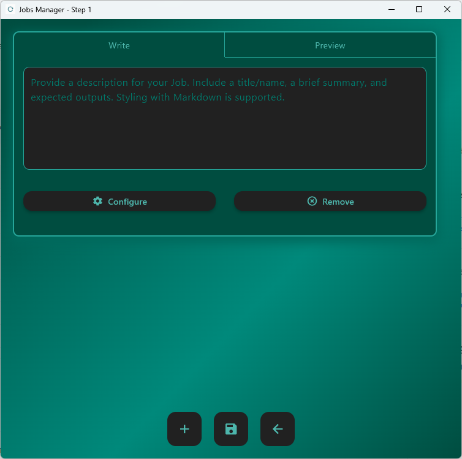

A Small Example in Stata (Windows, Local Execution)
===================================================

This example demonstrates how to run a minimal **Stata replication** using **ReRun** in **local mode** on **Windows**.  
The replication consists of a single **Step** and a single **Job**, showing the essential workflow for executing a 
Stata analysis through ReRun without containers.

Example Structure
-----------------

In this example, the project is located in:

``C:\Users\bpu060275\Desktop\work``

It contains two folders:

.. code-block:: text

   C:\Users\bpu060275\Desktop\work
   ├── data\
   │   └── auto.dta
   └── scripts\
       └── main.do

- The **data** folder holds the dataset ``auto.dta`` (the built-in Stata automobile dataset).
- The **scripts** folder contains a single script ``main.do``.
- No ``profile.do`` is needed — ReRun automatically generates one with the correct path variables when you launch a job.

The main script
---------------

The ``main.do`` file performs a small analysis using the dataset in the global ``path_source`` (set automatically by ReRun when the user sets the data path in the app).  
It then summarizes the data, runs a simple regression, and writes the results to a log file.

Example content:

.. code-block:: stata

   ***************************************************
   * main.do - Small ReRun Example (Windows Local)
   ***************************************************
   version 18.0
   clear all
   set more off

   include profile.do 
   
   * Change to the main script directory 
   cd "${path_main}"

   log using "auto_example.log", replace

   * Load dataset from ReRun-provided global path
   use "${path_source}\auto.dta", clear

   * Basic inspection
   describe
   summarize

   * Simple regression
   regress price mpg weight

   * Save output log
   log close

Execution Overview
------------------

This example will:

1. **Create one Step** named ``Step01``.
2. **Add one Job** named ``Job01`` that runs the ``main.do`` script.
3. **Select Local backend** and choose the system Stata executable (e.g., ``StataMP-64.exe``).
4. **Run the job** directly from ReRun.
5. **Verify output** in the generated log file ``auto_example.log``.

Expected Output
---------------

After running the job:

- A log file named ``auto_example.log`` will appear in the job directory.
- It contains the ``describe``, ``summarize``, and regression output for the ``auto.dta`` dataset.
- The ReRun log panel will show the job start, completion time, and a success message.

Running the Example in ReRun
----------------------------

This section illustrates, step-by-step, how to launch the ReRun application, create a new replication project for the Stata example, define the step and job, and execute it locally on Windows.  
Each stage is accompanied by screenshots from the ReRun interface.

Launching ReRun
---------------

Open **ReRun** from your desktop or terminal environment.  
The main application window appears, offering options to **Start a New Replication** or **Load an Existing Replication**.

.. image:: ../_static/stata_small_example/01_app_window/01_app_window.png
   :alt: ReRun application main window
   :width: 640

To start from scratch, click **Start New Replication**.

.. image:: ../_static/stata_small_example/01_app_window/03_start_new_replication.png
   :alt: Start new replication button
   :width: 640

Creating a New Replication
--------------------------

After selecting **Start New Replication**, the configuration window appears.  
Here you define the base paths for your project.

Specify the following paths:

- **Output path** → In this case, ``C:\Users\bpu060275\Desktop\work``
- **Data path** → The folder containing your dataset (e.g., ``data`` inside the output path). 

Once all paths are filled, click **Start**.

.. image:: ../_static/stata_small_example/02_start_load_window/04_start_new_window_start.png
   :alt: Start button for new replication
   :width: 640

ReRun uses these fields for configuration files that your scripts need.  
These configuration files are created automatically by the app.

Managing Steps
--------------

After initialization, ReRun opens the **Steps Window** where you define the main stages of your replication.  
One step is added by default, but you will need to configure it.

You may add a small description to your step.  
This text renders as markdown in the **Preview Tab** and is saved to a file named ``readme.md`` in the step directory (e.g. ``Step01``).  
The full replication readme will also include the contents provided in this field.

.. image:: ../_static/stata_small_example/03_steps_window/08_steps_window_step_text_field.png
   :alt: Step text field
   :width: 640

To add global notes to the replication, click the **Notes** button.

.. image:: ../_static/stata_small_example/03_steps_window/10_steps_window_entry_project_notes.png
   :alt: Opening project notes
   :width: 640

Provide some general information about your replication.  
The text is rendered as markdown in the **Preview Tab**:

After defining your step, click **Configure** to open the Job Manager.

.. image:: ../_static/stata_small_example/03_steps_window/17_steps_window_step_configure.png
   :alt: Configure step button
   :width: 640

Defining Jobs
-------------

In the **Jobs Window**, you define one or more jobs for the selected step.  
As you can see in the **Title Bar**, you are setting jobs for **Step 1**.

Add a small description for your job.  
This text renders as markdown in the **Preview Tab** and is saved to a file named ``readme.md`` in the job directory (e.g. ``Job01``).  
The full replication readme will also include the contents provided in this field.

.. image:: ../_static/stata_small_example/04_jobs_window/06_jobs_window_job_text_field.png
   :alt: Job text field
   :width: 640

To configure the job, click **Configure**.

.. image:: ../_static/stata_small_example/04_jobs_window/08_jobs_window_job_configure.png
   :alt: Configure job button
   :width: 640

Configuring the Job
-------------------

In the **Job Configuration Window**, provide the inputs for the local run example using **Stata**.  

Key settings for this example:

- **Language/Runner** → Stata  
- **Main Path** → ``C:\Users\bpu060275\Desktop\work\scripts``  
- **Main Script** → ``main.do`` (located in the ``scripts`` folder)  
- **Command** → Full path to Stata + instructions:  
  ``C:\Program Files\StataNow19\StataMP-64.exe /e do``  

.. note::

   The **Main Path** defines the folder that ReRun uses as the source when creating the **Job Path**.  
   All files needed by the job — including the main script and any dependencies — must be located inside this folder or its subdirectories.

   Before execution, ReRun copies the selected contents inside the Main Path into the Job Path.  
   This means:

   - If your main script or dependencies are outside the Main Path, ReRun will not find them and an error will occur.  
   - If your script is inside a subfolder (for example, ``scripts\stata\main.do``), that same subfolder structure will be preserved inside the Job Path.  
   - In this example, since ``main.do`` is directly inside the Main Path (``...\scripts``), it will be copied automatically to the Job Path.

Save your configurations to return to the Jobs view.

.. image:: ../_static/stata_small_example/05_jobconfig_window/12_jobconfig_window_save_configurations.png
   :alt: Save job configurations
   :width: 640

And save your jobs to return to the Steps view.

.. image:: ../_static/stata_small_example/05_jobconfig_window/13_jobconfig_window_save_jobs.png
   :alt: Save jobs configuration
   :width: 640

.. warning::
   Job configurations and jobs are not saved unless you explicitly click the buttons to save them.

Running the Replication
-----------------------

Once your job is defined and saved, click **Run Steps** in the Steps Window to execute the replication.

ReRun opens the **Execution Window**, where you can monitor job progress and logs in real time.

If necessary, you can **stop execution** using the Stop button.

.. image:: ../_static/stata_small_example/06_execution_window/03_execution_window_stop_button.png
   :alt: Stop button during execution
   :width: 640

When the job finishes, ReRun displays a completion message.

Click **Back to Steps** to return to the workflow view.

Output
------

After the job completes successfully, ReRun automatically creates a structured and versioned output folder under the specified **Output Path**.  
A parent directory named ``Replications`` is created (if it does not already exist), and each new replication receives a numbered subfolder (``Rep001``, ``Rep002``, etc.) to ensure previous runs are preserved.

Example output structure:

.. code-block:: text

   └─── Rep001
       ├── config.json
       ├── datafiles.txt
       ├── log.txt
       ├── manifest.json
       ├── readme.md
       ├── replication_tree.txt
       │
       └─── Step01
           ├── readme.md
           │
           └─── Job01
               ├── auto_example.log
               ├── main.do
               ├── main.log
               ├── profile.do
               ├── readme.md
               └── stata_requirements.txt

Configuration and Log Files
---------------------------

**config.json** Defines the structure and parameters of the current replication — including output paths, data paths, and step/job definitions.

.. code-block:: json
   :caption: config.json (excerpt)

   {
       "output_path": "C:/Users/bpu060275/Desktop/work/Replications/Rep001",
       "data_path": "C:/Users/bpu060275/Desktop/work/data",
       "steps": [
           {
               "index": 1,
               "description": "# Step 1\n\n- **Test step**: contains only one job",
               "jobs": [
                   {
                       "index": 1,
                       "description": "# Job 1\n\n- Test job: run a test script in Stata",
                       "configurations": {
                           "main_path": "Step01/Job01",
                           "main_script": "main.do",
                           "command": "C:\\Program Files\\StataNow19\\StataMP-64.exe /e do"
                       }
                   }
               ]
           }
       ]
   }

This file captures all configuration metadata required to reproduce the run, including container 
images, files, paths, and commands.

**datafiles.txt** Lists all data files used in the replication, along with modification timestamps, SHA256 hashes, and integrity status.

.. code-block:: text
   :caption: datafiles.txt (excerpt)

   Data Directory: C:/Users/bpu060275/Desktop/work/data

   File          Date modified             Hash                                        Status
   ------------------------------------------------------------------------------------------
   auto.dta      2025-10-23 12:18:31       92846f09c6c7f55a24ad9c4ec2b669f5100c0981    Unchanged

This record ensures data provenance and helps verify whether input data has changed during the run.

**log.txt** Chronological execution log that records every action performed by ReRun during setup and execution.

.. code-block:: text
   :caption: log.txt (excerpt)

   [2025-10-23 14:32:14]  Execution started...
   [2025-10-23 14:32:14]  'Step 1' starting...
   [2025-10-23 14:32:14]  [ Step 1 ] 'Job 1' starting...
   [2025-10-23 14:32:14]  [ Step 1 ] [ Job 1 ] PID: 14480
   [2025-10-23 14:32:16]  [ Step 1 ] 'Job 1' completed successfully in 0:00:02
   [2025-10-23 14:32:17]  Replication completed.

This file provides full traceability of the execution process.

**manifest.json** A detailed record of inputs and outputs, including their sizes, hashes, and timestamps — enabling complete reproducibility verification.

.. code-block:: json
   :caption: manifest.json (excerpt)

   {
      "version": 1,
      "run_id": "f1e2a994-91f7-477c-8592-fc2c09b35aa8",
      "input_hash": "2f25b11bf6089cbaa27fddb9556bdf55e867aa4e0a80d902b0183725fc912aa6",
      "output_hash": "aece4a722bb385cdff17079b3b342814487bc7327e6efae30497e71b4eb40369",
      "root_hash": "3ef30365955c68d745a89ef922599cca37d4601d143ba38f0fdf2315bea5f185",
      "app_version": "0.0.1",
      "created_at": "2025-10-17T15:30:52Z",
      "manifest": {
        "version": 1,
        "root_path": "C:/Users/bpu060275/Desktop/work/Replications/Rep001",
           "input": [
               {
                   "path": "Step01/Job01/main.do",
                   "sha256": "e06acfa2fb424adb32fa46810aa6bc4634f517476f70a8fe70c7436cbe5ed342"
               }
           ],
           "output": [
               {
                   "path": "Step01/Job01/auto_example.log",
                   "sha256": "462f96feaa0649d0eaf8eb653ecf867d262d49237475676ba62ebe1f7008445a"
               }
           ]
       }
   }

The manifest is particularly useful for audits and external reproducibility checks.

**readme.md** Automatically generated documentation that consolidates information from the replication, steps, and jobs.

.. code-block:: markdown
   :caption: readme.md (excerpt)

   # Overview

   **Description**: ...

   ## 2. Data
   - **auto.dta**: built-in auto dataset

   ## 3. Code
   - **main.do**: simple description and regression

   ## 4. Outputs
   - **auto_example.log**

   **Run time:** 0:00:00  
   **Storage used:** 4.99 KB

This serves as a self-contained human-readable summary of the replication.

**replication_tree.txt** Provides a tree-like representation of the project structure (pre-run).

.. code-block:: text
   :caption: replication_tree.txt

   Root: C:/Users/bpu060275/Desktop/work/Replications/Rep001
   ├── config.json
   └── Step01/
       ├── readme.md
       └── Job01/
           ├── main.do
           ├── profile.do
           └── readme.md

   2 directories, 5 files

This lightweight index helps users quickly inspect the structure of a replication from the command line or within version control.

Within each **Step** folder:

- Each step has its own ``readme.md`` summarizing its content.  
- The **Job** folder (e.g., ``Job01``) contains all the files required to run and reproduce that job:
- ``auto_example.log`` – The Stata output log generated by the main script.  
- ``main.do`` – The job’s main Stata script.  
- ``main.log`` – Execution log capturing command-level details (automatically created by Stata in batch mode).  
- ``profile.do`` – Automatically generated by ReRun; defines path variables like ``path_main`` and ``path_source``.  
- ``stata_requirements.txt`` – A record of required Stata packages and its version (requires the installation of the Stata package `stata-require <https://github.com/sergiocorreia/stata-require>`_).

Reproducibility and Versioning
------------------------------

Each replication run receives a unique **Rep###** identifier and an internal **run ID** stored in the manifest.  
Combined with file hashes, timestamps, and configuration metadata, this guarantees that analyses can be fully reproduced even across different systems.

.. note::

   The ``Replications`` folder acts as a permanent record of analytical runs.  
   Each numbered replication contains all the information needed to repeat or audit the analysis later.

.. note::

   The ``Rep###`` numbering ensures that each replication run is kept separate and never overwrites a previous one.  
   You can safely run new replications without manually managing output directories.
