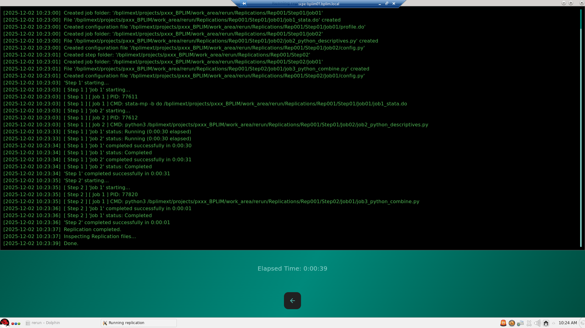

A Mixed-Language Workflow Example
=================================

This example illustrates how to build a **multi-language, multi-step workflow** using ReRun, combining:

- **Step 1:** two jobs running **in parallel** (one in **Stata**, one in **Python**)  
- **Step 2:** a Python job that **consumes the outputs** generated in Step 1  
- **Execution in a Linux environment**, specifically in **BPLIM Server**, using a
  Singularity image that already includes ReRun, Stata, and Python

Although this example was executed in the BPLIM environment, any user can replicate the workflow
on a different system (local machine or server) as long as Stata and Python are installed — either
locally or within a container (Docker, Singularity, Apptainer).

.. note::
   In the BPLIM external server, the runtime environment (Stata + Python + ReRun) is already included
   in a Singularity image.  
   Because all tools are pre-installed, the **Tools** field in the Job Configuration window is left empty.

Input Directory Structure
-------------------------

In the BPLIM external server, the input data and scripts for this example are located at:

- **Data path**:  
  ``/bplimext/projects/pxxx_BPLIM/initial_dataset``

- **Scripts path**:  
  ``/bplimext/projects/pxxx_BPLIM/work_area/rerun/scripts``

A minimal structure looks like:

.. code-block:: text

   /bplimext/projects/pxxx_BPLIM/
   ├── initial_dataset/
   │   └── auto.dta
   └── work_area/
       └── rerun/
           └── scripts/
               ├── job1_stata.do
               ├── job2_python_descriptives.py
               └── job3_python_combine.py

Launching the Replication
-------------------------

Start App Panel
~~~~~~~~~~~~~~~

.. image:: ../_static/mixed_example/01_start_app.png
   :alt: Start ReRun application
   :width: 650

Click **Start New Replication**.

Provide Input Paths
~~~~~~~~~~~~~~~~~~~

.. image:: ../_static/mixed_example/02_input_paths.png
   :alt: Input paths for mixed example
   :width: 650

Fill in the BPLIM paths:

- **Output Path**  
  ``/bplimext/projects/pxxx_BPLIM/work_area/rerun``  
  ReRun will create a ``Replications/RepNNN`` folder here.

- **Data Path**  
  ``/bplimext/projects/pxxx_BPLIM/initial_dataset``

Click **Start** to generate the replication structure.

Step 1 — Parallel Jobs (Stata + Python)
---------------------------------------

Steps Panel
~~~~~~~~~~~

.. image:: ../_static/mixed_example/03_steps_panel.png
   :alt: Steps panel overview
   :width: 650

Click **Configure** on Step 1.

Step 1 — Jobs Panel
~~~~~~~~~~~~~~~~~~~

.. image:: ../_static/mixed_example/04_step1_jobs_panel.png
   :alt: Step 1 Jobs panel
   :width: 650

Click **Configure** on **Job 1**.

Configure Job 1 - Step 1 (Stata)
~~~~~~~~~~~~~~~~~~~~~~~~~~~~~~~~

.. image:: ../_static/mixed_example/05_job1_config.png
   :alt: Job 1 configuration (Stata)
   :width: 650

- **Main Path** → ``/bplimext/projects/pxxx_BPLIM/work_area/rerun/scripts``
- **Main Script** → ``/bplimext/projects/pxxx_BPLIM/work_area/rerun/scripts/job1_stata.do``
- **Container Image** → *leave empty*  
  (we rely on the BPLIM-provided Apptainer image)
- **Command** → ``stata-mp -b do``

Save.

Configure Job 2 - Step 1 (Python)
~~~~~~~~~~~~~~~~~~~~~~~~~~~~~~~~~

.. image:: ../_static/mixed_example/06_job2_config.png
   :alt: Job 2 configuration (Python)
   :width: 650

- **Main Path** → ``/bplimext/projects/pxxx_BPLIM/work_area/rerun/scripts``
- **Main Script** → ``job2_python_descriptives.py``
- **Command** → ``python3``

Save jobs and return to the Steps Panel. Click **Configure** on Step 2.

Step 2 — Sequential Job (Python Combine)
----------------------------------------

Step 2 — Jobs Panel
~~~~~~~~~~~~~~~~~~~

.. image:: ../_static/mixed_example/07_step2_jobs_panel.png
   :alt: Step 2 Jobs panel
   :width: 650

Click **Configure** on **Job 1**.

Configure Job 1 - Step 2 (Python)
~~~~~~~~~~~~~~~~~~~~~~~~~~~~~~~~~

.. image:: ../_static/mixed_example/08_job3_config.png
   :alt: Job 3 configuration
   :width: 650

- **Main Path** → ``/bplimext/projects/pxxx_BPLIM/work_area/rerun/scripts``
- **Main Script** → ``/bplimext/projects/pxxx_BPLIM/work_area/rerun/scripts/job3_python_combine.py``
- **Command** → ``python3``

Save the configurations.

Running the Replication
-----------------------

After saving the Jobs for **Step 2**, go back to the Steps Panel and click **Run Steps**.

.. image:: ../_static/mixed_example/09_run_steps.png
   :alt: Run Steps button
   :width: 650

Execution Window
----------------

Step 1 — Stata and Python jobs running **in parallel**:

.. image:: ../_static/mixed_example/10_execution_parallel.png
   :alt: Step 1 parallel execution
   :width: 650

Step 2 — Python job running **after both Step 1 jobs finish**:

.. image:: ../_static/mixed_example/11_execution_step2.png
   :alt: Step 2 execution
   :width: 650

Replication finished after all steps completion

Job Scripts (Full Contents)
---------------------------

Below are the three scripts used in the workflow, in execution order.

Step 1 — Job 1 (Stata)
~~~~~~~~~~~~~~~~~~~~~~

.. code-block:: stata
   :caption: job1_stata.do

   ***************************************************
   * job1_stata.do  — Step 1, Job 1 (Stata)
   * - Reads data from ${path_source}/auto.dta
   * - Produces summary stats and group means
   * - Writes: results/stata_job1.log, results/stata_summary.csv
   ***************************************************
   version 18.0
   clear all
   set more off

   * Load ReRun environment (rep_path, job_path, path_main, path_source, etc.)
   include profile.do

   * The main script directory 
   cd "${path_main}"

   * Ensure results folder exists
   global path_results "${job_path}/results"
   capture mkdir "${path_results}"

   * Start log inside job_path/results
   log using "${path_results}/stata_job1.log", replace

   *** Load data ***
   use "${path_source}/auto", clear

   *** Summaries ***
   describe
   summarize price mpg weight, detail

   *** Group means ***
   preserve
      collapse (mean) price mpg weight, by(foreign)
      export delimited using "${path_results}/stata_summary.csv", replace
   restore

   *** Simulated runtime (~30 seconds) ***
   forvalues t = 1/6 {
      di as txt "Stata Job1 progress: " `t' " / 6"
      sleep 5000
   }

   log close
   exit 0

Step 1 — Job 2 (Python)
~~~~~~~~~~~~~~~~~~~~~~~

.. code-block:: python
   :caption: job2_python_descriptives.py

   """
   job2_python_descriptives.py — Step 1, Job 2 (Python)
   - Reads data from PATH_SOURCE
   - Writes results into JOB_PATH/results
   - Logs all progress to results/python_job2.log
   """

   import time
   import logging
   from pathlib import Path

   import pandas as pd

   from config import PATH_SOURCE, JOB_PATH

   def setup_logger(log_path: Path):
      """Configure logging to file only."""
      logging.basicConfig(
         level=logging.INFO,
         format="%(asctime)s [%(levelname)s] %(message)s",
         handlers=[
               logging.FileHandler(log_path, mode="w", encoding="utf-8")
         ]
      )

   def main() -> None:
      results_dir = JOB_PATH / "results"
      results_dir.mkdir(exist_ok=True)

      log_file = results_dir / "python_job2.log"
      setup_logger(log_file)

      logging.info("Starting Python Job 2")

      data_file = PATH_SOURCE / "auto.dta"
      summary_out = results_dir / "python_summary.csv"
      corr_out = results_dir / "python_corr.csv"

      logging.info(f"Reading data from: {data_file}")
      df = pd.read_stata(data_file)

      vars_of_interest = ["price", "mpg", "weight"]

      # Summary statistics
      df[vars_of_interest].describe().to_csv(summary_out)
      logging.info(f"Summary written to: {summary_out}")

      # Correlation matrix
      df[vars_of_interest].corr().to_csv(corr_out)
      logging.info(f"Correlation matrix written to: {corr_out}")

      # Simulated runtime (~30s)
      for t in range(6):
         logging.info(f"Progress {t + 1} / 6")
         time.sleep(5)

      logging.info("Python Job 2 completed successfully")

   if __name__ == "__main__":
      main()

Step 2 — Job 3 (Python Combine)
~~~~~~~~~~~~~~~~~~~~~~~~~~~~~~~

.. code-block:: python
   :caption: job3_python_combine.py

   """
   job3_python_combine.py — Step 2, Job 1 (Python)
   - Combines results from Step 1 jobs
   - Writes combined_report.txt to JOB_PATH/results
   - Logs all progress to results/combine_job.log
   """

   import logging
   from pathlib import Path

   import pandas as pd

   from config import JOB_PATH, PATH_STEP01_JOB01, PATH_STEP01_JOB02

   def setup_logger(log_path: Path):
      """Configure logging to file only."""
      logging.basicConfig(
         level=logging.INFO,
         format="%(asctime)s [%(levelname)s] %(message)s",
         handlers=[
               logging.FileHandler(log_path, mode="w", encoding="utf-8")
         ]
      )

   def main() -> None:
      results_dir = JOB_PATH / "results"
      results_dir.mkdir(exist_ok=True)

      log_file = results_dir / "combine_job.log"
      setup_logger(log_file)

      logging.info("Starting Step 2 — Combine Job")

      stata_summary = PATH_STEP01_JOB01 / "results" / "stata_summary.csv"
      py_summary = PATH_STEP01_JOB02 / "results" / "python_summary.csv"
      py_corr = PATH_STEP01_JOB02 / "results" / "python_corr.csv"

      logging.info(f"Reading Stata summary: {stata_summary.as_posix()}")
      df_stata = pd.read_csv(stata_summary)

      logging.info(f"Reading Python summary: {py_summary.as_posix()}")
      df_py_summary = pd.read_csv(py_summary, index_col=0)

      logging.info(f"Reading Python correlation: {py_corr.as_posix()}")
      df_py_corr = pd.read_csv(py_corr, index_col=0)

      report_path = results_dir / "combined_report.txt"

      logging.info(f"Writing final report to: {report_path}")

      with report_path.open("w", encoding="utf-8") as f:
         f.write("Mixed-language Replication: Stata + Python\n")
         f.write("=========================================\n\n")

         f.write("1. Stata summary (means by foreign)\n")
         f.write("-----------------------------------\n")
         f.write(df_stata.to_string(index=False))
         f.write("\n\n")

         f.write("2. Python summary\n")
         f.write("-----------------\n")
         f.write(df_py_summary.to_string())
         f.write("\n\n")

         f.write("3. Python correlation matrix\n")
         f.write("----------------------------\n")
         f.write(df_py_corr.to_string())
         f.write("\n")

      logging.info("Combine job completed successfully")

   if __name__ == "__main__":
      main()

.. important::
   ReRun automatically exposes variables pointing to previous job outputs inside ``config.py``:

   - ``PATH_STEP01_JOB01`` → path to Step 1, Job 1 folder  
   - ``PATH_STEP01_JOB02`` → path to Step 1, Job 2 folder  

   This makes it easy for Job 3 to read the output files created in Step 1. 

   In Stata the path will be exposed as the global ``path_step##_job##`` (and used as 
   ``${path_step##_job##}``) and in R as the variable ``path_step##_job##``. 

Output Structure
----------------

After running the replication on the BPLIM server:

.. code-block:: text

   /bplimext/projects/pxxx_BPLIM/work_area/rerun/Replications/Rep001/
   ├── config.json
   ├── datafiles.txt
   ├── log.txt
   ├── manifest.json
   ├── readme.md
   ├── replication_tree.txt
   ├── Step01/
   │   ├── readme.md
   │   ├── Job01/
   │   │   ├── job1_stata.do
   │   │   ├── job1_stata.log
   │   │   ├── profile.do
   │   │   ├── readme.md
   │   │   └── results/
   │   │       ├── stata_job1.log
   │   │       └── stata_summary.csv
   │   └── Job02/
   │       ├── config.py
   │       ├── job2_python_descriptives.py
   │       ├── python_requirements.txt
   │       ├── readme.md
   │       └── results/
   │           ├── python_corr.csv
   │           ├── python_job2.log
   │           └── python_summary.csv
   └── Step02/
      ├── readme.md
      └── Job01/
         ├── config.py
         ├── job3_python_combine.py
         ├── python_requirements.txt
         ├── readme.md
         └── results/
               ├── combine_job.log
               └── combined_report.txt

