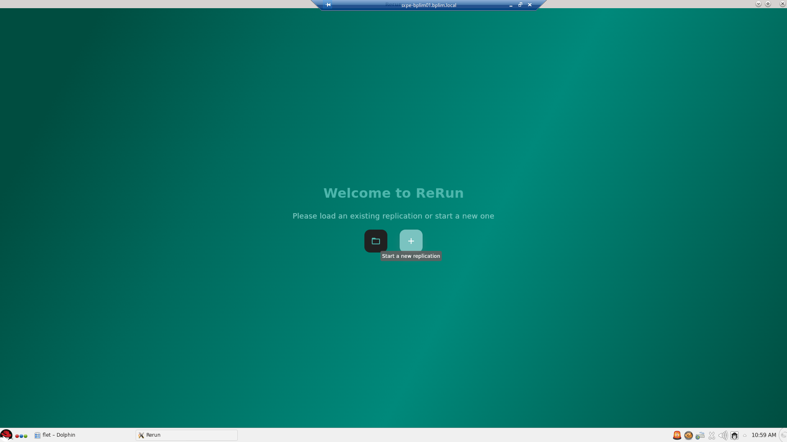
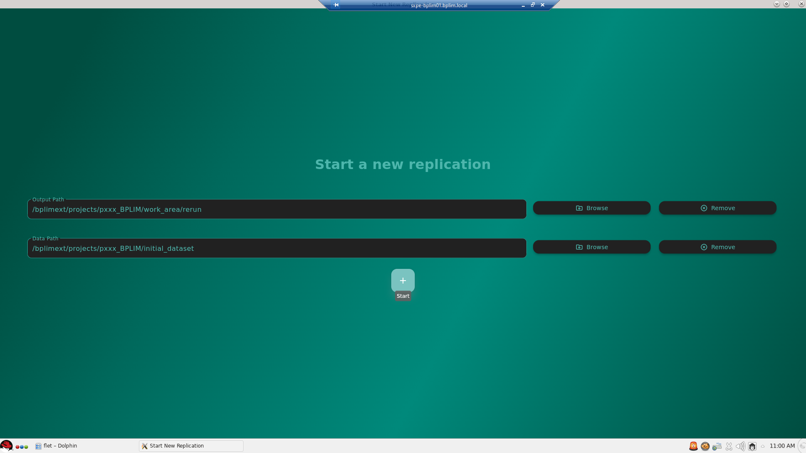
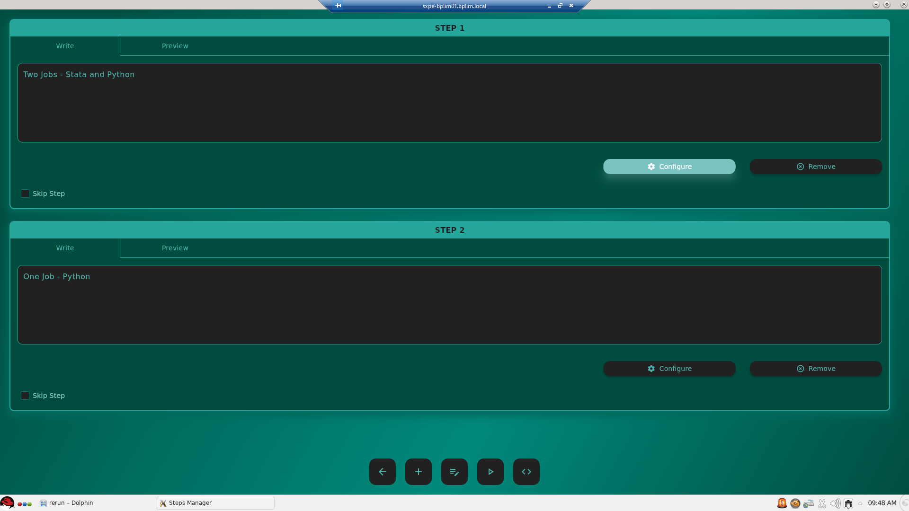
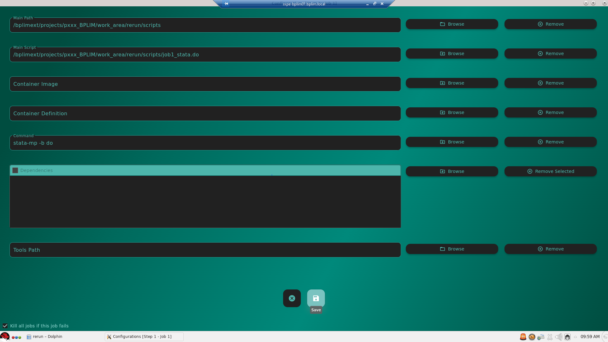
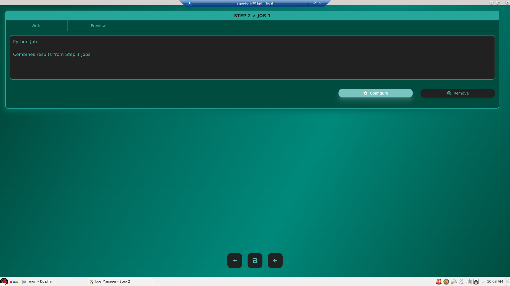
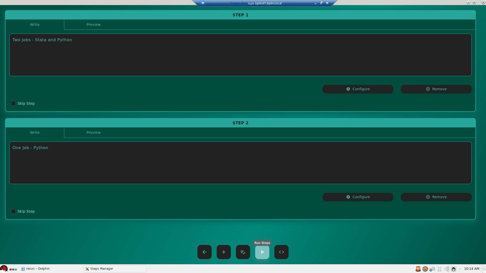
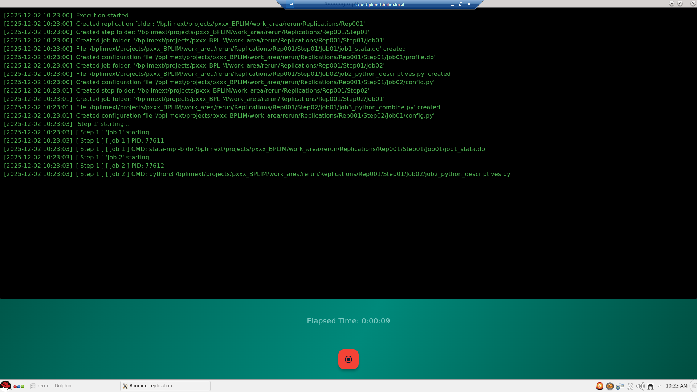
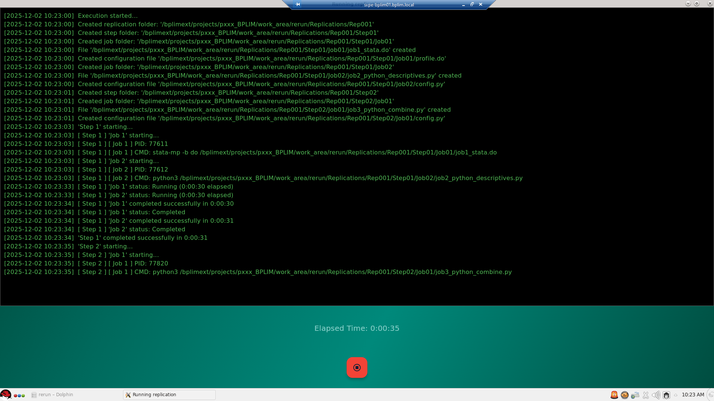

A Mixed-Language Workflow Example
=================================

This example illustrates how to build a **multi-language, multi-step workflow** using ReRun, combining:

- **Step 1:** two jobs running **in parallel** (one in **Stata**, one in **Python**)  
- **Step 2:** a Python job that **consumes the outputs** generated in Step 1  
- **Execution in a Linux environment**, specifically in **BPLIM Server**, using a
  Singularity image that already includes ReRun, Stata, and Python

Although this example was executed in the BPLIM environment, any user can replicate the workflow
on a different system (local machine or server) as long as Stata and Python are installed — either
locally or within a container (Docker, Singularity, Apptainer).

.. note::
   In the BPLIM external server, the runtime environment (Stata + Python + ReRun) is already included
   in a Singularity image.  
   Because all tools are pre-installed, the **Tools** field in the Job Configuration window is left empty.

Input Directory Structure
-------------------------

In the BPLIM external server, the input data and scripts for this example are located at:

- **Data path**:  
  ``/bplimext/projects/pxxx_BPLIM/initial_dataset``

- **Scripts path**:  
  ``/bplimext/projects/pxxx_BPLIM/work_area/rerun/scripts``

A minimal structure looks like:

.. code-block:: text

   /bplimext/projects/pxxx_BPLIM/
   ├── initial_dataset/
   │   └── auto.dta
   └── work_area/
       └── rerun/
           └── scripts/
               ├── job1_stata.do
               ├── job2_python_descriptives.py
               └── job3_python_combine.py

Launching the Replication
-------------------------

Start App Panel
~~~~~~~~~~~~~~~

Click **Start New Replication**.

Provide Input Paths
~~~~~~~~~~~~~~~~~~~

Fill in the BPLIM paths:

- **Output Path**  
  ``/bplimext/projects/pxxx_BPLIM/work_area/rerun``  
  ReRun will create a ``Replications/RepNNN`` folder here.

- **Data Path**  
  ``/bplimext/projects/pxxx_BPLIM/initial_dataset``

Click **Start** to generate the replication structure.

Step 1 — Parallel Jobs (Stata + Python)
---------------------------------------

Steps Panel
~~~~~~~~~~~

Click **Configure** on Step 1.

Step 1 — Jobs Panel
~~~~~~~~~~~~~~~~~~~

Click **Add Job** twice to create **Job 1** and **Job 2**.

Configure Job 1 (Stata)
~~~~~~~~~~~~~~~~~~~~~~~

- **Main Path** → ``/bplimext/projects/pxxx_BPLIM/work_area/rerun/scripts``
- **Main Script** → ``job1_stata.do``
- **Container Image** → *leave empty*  
  (we rely on the BPLIM-provided Apptainer image)
- **Command** → ``stata-mp -b do``

Save.

Configure Job 2 (Python)
~~~~~~~~~~~~~~~~~~~~~~~~

- **Main Path** → ``/bplimext/projects/pxxx_BPLIM/work_area/rerun/scripts``
- **Main Script** → ``job2_python_descriptives.py``
- **Command** → ``python3``

Save jobs and return to the Steps Panel.

Step 2 — Sequential Job (Python Combine)
----------------------------------------

Step 2 — Jobs Panel
~~~~~~~~~~~~~~~~~~~

Click **Add Job** to create **Job 3**.

Configure Job 3 (Python)
~~~~~~~~~~~~~~~~~~~~~~~~

- **Main Path** → ``/bplimext/projects/pxxx_BPLIM/work_area/rerun/scripts``
- **Main Script** → ``job3_python_combine.py``
- **Command** → ``python3``

.. important::
   ReRun automatically exposes variables pointing to previous job outputs inside ``config.py``:

   - ``PATH_STEP01_JOB01`` → path to Step 1, Job 1 folder  
   - ``PATH_STEP01_JOB02`` → path to Step 1, Job 2 folder  

   This makes it easy for Job 3 to read the output files created in Step 1.

Running the Replication
-----------------------

Back in the Steps Panel, click **Run Steps**.

Execution Window
----------------

Step 1 — Stata and Python jobs running **in parallel**:

Step 2 — Python job running **after both Step 1 jobs finish**:

Job Scripts (Full Contents)
---------------------------

Below are the three scripts used in the workflow, in execution order.

Step 1 — Job 1 (Stata)
~~~~~~~~~~~~~~~~~~~~~~

.. code-block:: stata
   :caption: job1_stata.do

    ***************************************************
    * Step 1 — Job 1 (Stata)
    ***************************************************
    version 18.0
    clear all
    set more off

    include profile.do
    cd "${job_path}"

    mkdir results

    log using "results/stata_job1.log", replace

    use "${path_source}/auto.dta", clear

    collapse (mean) price mpg weight, by(foreign)
    export delimited using "results/stata_summary.csv", replace

    forvalues t = 1/6 {
        di as txt "Job1 progress: " `t' "/6"
        sleep 5000
    }

    log close
    exit 0

Step 1 — Job 2 (Python)
~~~~~~~~~~~~~~~~~~~~~~~

.. code-block:: python
   :caption: job2_python_descriptives.py

    import time
    import logging
    from pathlib import Path
    import pandas as pd
    from config import PATH_SOURCE, JOB_PATH

    def setup_logger(log_path):
        logging.basicConfig(
            level=logging.INFO,
            format="%(asctime)s [%(levelname)s] %(message)s",
            handlers=[logging.FileHandler(log_path, encoding="utf-8")]
        )

    def main():
        job_dir = Path(JOB_PATH)
        results_dir = job_dir / "results"
        results_dir.mkdir(exist_ok=True)

        log_file = results_dir / "python_job2.log"
        setup_logger(log_file)

        df = pd.read_stata(Path(PATH_SOURCE) / "auto.dta")

        df[["price","mpg","weight"]].describe().to_csv(results_dir / "python_summary.csv")
        df[["price","mpg","weight"]].corr().to_csv(results_dir / "python_corr.csv")

        for t in range(6):
            logging.info(f"Progress {t+1}/6")
            time.sleep(5)

    if __name__ == "__main__":
        main()

Step 2 — Job 3 (Python Combine)
~~~~~~~~~~~~~~~~~~~~~~~~~~~~~~~

.. code-block:: python
   :caption: job3_python_combine.py

    import logging
    from pathlib import Path
    import pandas as pd

    from config import JOB_PATH, PATH_STEP01_JOB01, PATH_STEP01_JOB02

    def setup_logger(log_path):
        logging.basicConfig(
            level=logging.INFO,
            format="%(asctime)s [%(levelname)s] %(message)s",
            handlers=[logging.FileHandler(log_path, encoding="utf-8")]
        )

    def main():
        job_dir = Path(JOB_PATH)
        results_dir = job_dir / "results"
        results_dir.mkdir(exist_ok=True)

        log_file = results_dir / "combine_job.log"
        setup_logger(log_file)

        stata_summary = Path(PATH_STEP01_JOB01) / "results/stata_summary.csv"
        py_summary = Path(PATH_STEP01_JOB02) / "results/python_summary.csv"
        py_corr = Path(PATH_STEP01_JOB02) / "results/python_corr.csv"

        df_stata = pd.read_csv(stata_summary)
        df_sum = pd.read_csv(py_summary, index_col=0)
        df_corr = pd.read_csv(py_corr, index_col=0)

        with open(results_dir / "combined_report.txt", "w") as f:
            f.write("Mixed-Language Example: Combined Results\n\n")
            f.write(df_stata.to_string(index=False) + "\n\n")
            f.write(df_sum.to_string() + "\n\n")
            f.write(df_corr.to_string() + "\n")

    if __name__ == "__main__":
        main()

Output Structure
----------------

After running the replication on the BPLIM server:

.. code-block:: text

   /bplimext/projects/pxxx_BPLIM/work_area/rerun/Replications/RepNNN/
   ├── config.json
   ├── manifest.json
   ├── log.txt
   ├── Step01/
   │   ├── Job01/
   │   │   └── results/stata_summary.csv
   │   └── Job02/
   │       └── results/
   │           ├── python_summary.csv
   │           └── python_corr.csv
   └── Step02/
       └── Job01/
           └── results/
               └── combined_report.txt

Summary
-------

This example demonstrates how to:

1. Mix **Stata** and **Python** in the same workflow  
2. Run jobs **in parallel** within a step  
3. Run steps **sequentially**  
4. Use ReRun’s **auto-generated path variables** to access outputs from earlier steps  
5. Execute everything in a **Singularity/Apptainer** environment on the BPLIM external server  
6. Produce clean, isolated, reproducible job outputs  

Even though this demonstration was run in BPLIM, the workflow can be reproduced on any system with
Stata and Python installed — either natively or via Docker/Singularity.

